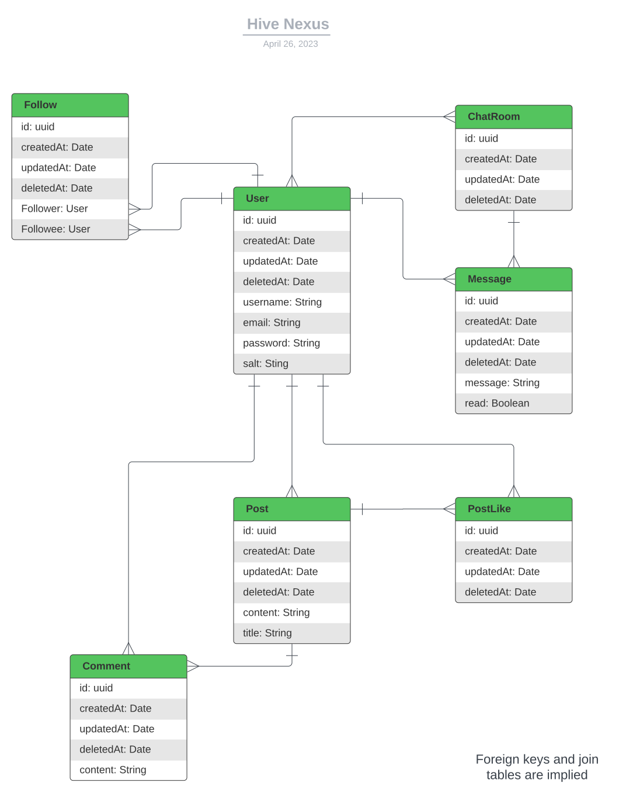
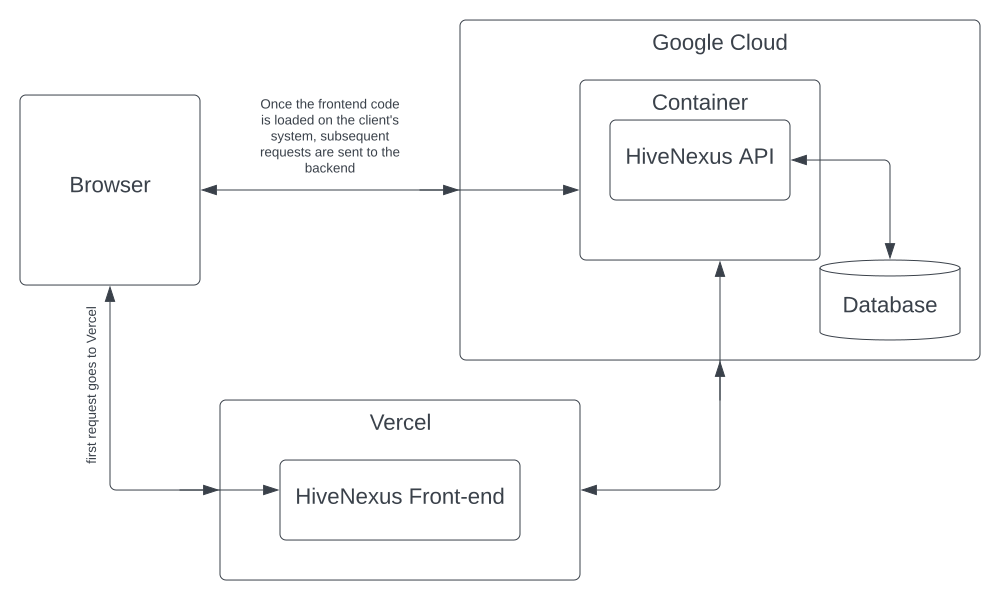
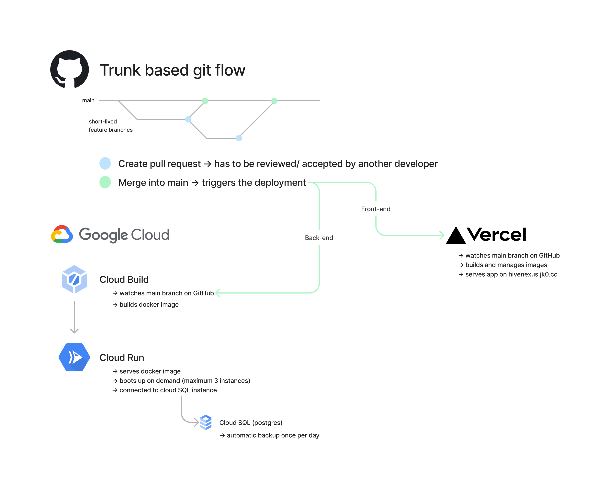
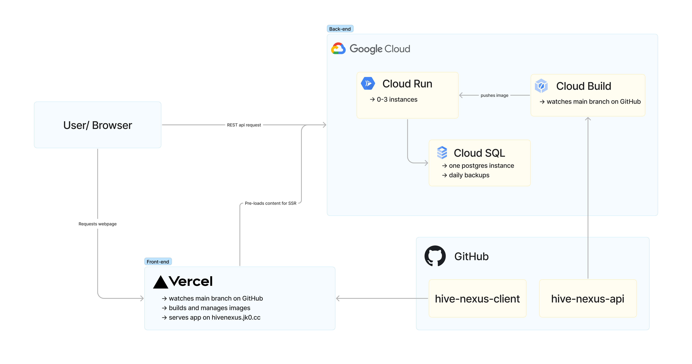

# Setup

1. install Go and postgres
2. create your local database (e.g. `createdb hive-nexus-api`)
3. create a `app.env` file and copy out the content of the `example.env` and change it depending on your settings
4. you may need to run `go mod download` or `go get ./...` to fetch all the required packages
5. run the application with `go run ./src/main.go`

We are using gofmt as a formatter to format our code. To format the repo use `gofmt -w -s -l .`

# About the Backend

The backend has a monolith architecture (all of the backend is run as one process on one machine). The pattern used is essentially an MVC model.

The backend implements a REST API to respond to queries submitted by the frontend. The notable resources currently supported by the backend are user, post, comment, like, and auth. Below is a complete list of currently available paths with a brief description:

- GET /user/one access data for one user (email or username is provided with a query string)
- POST /post/create submit a post to be created on the network
- POST /post/delete delete a post
- GET /post/one obtain data for one post (post ID is given through a query string)
- GET /post/all obtain data for all posts (pagination is to be implemented)
- POST /like/create like a post
- POST /like/delete remove a like from the post
- POST /comment/create submit a comment for a post
- POST /comment/delete submit a request to delete a post
- GET /comment/get-multiple returnes the comments of one post or one user, depending on the parameters
- POST /auth/sign-up path used for signing up as a new user
- POST /auth/sign-in path used for signing in
- GET /auth/availability-check path used for checking if a username is available or already taken

## Database

 ER Diagram

# Architecture

Below you can see an architecture diagram for the application (include the frontend):

 Architecture Diagram

## CICD Architecture

 CICD Diagram

## Cloud Architecture

 CICD Diagram
